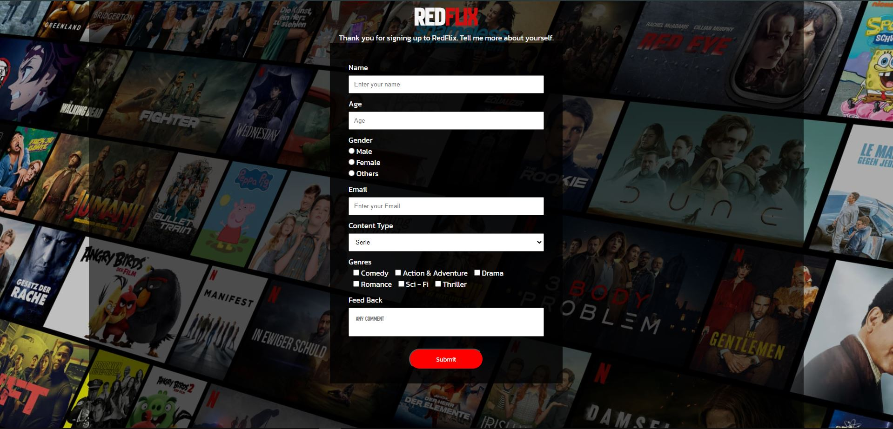

# <a href="https://malibilmez.github.io/redflix/">RedFlix</a>

## Description
This project aims to create a form page inspired by the Netflix design.

## Outcome

### At the end of the project, following topics are to be covered;

- HTML 

- HTML form elements such as input, label, select, and option

- CSS Setting height and width-CSS Outline-CSS Combinators

- By working on this project, i can enhance my HTML and CSS skills, practice responsive design, and gain hands-on experience in building a user interface.

## Steps to Solution

>>Part-1 HTML Structure

	- Creat structure of the HTML5
	- Give name of your project (title)
	- Create the main structure of the header
	- Create a form using input, label, select, option elements using div element inside the form element.

>>Part-2 CSS Structure

	- Set a background
	- Set container background color and margin
	- Define others color-size-padding etc...

- Step 4: Push your application into your own public repo on Github

- Step 5: Deploy your application on Github template to showcase your app within your team.